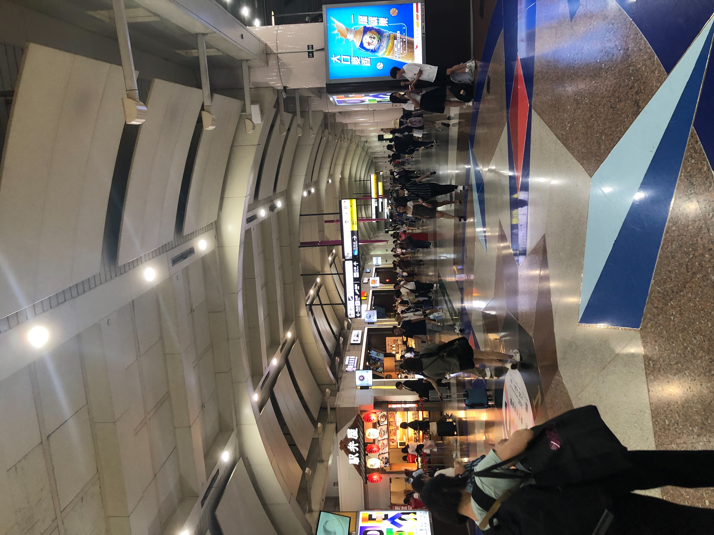

這一天的減敏嘗試，是請老婆陪我搭捷運到板橋，總共要搭三站。
這一次整體的狀態還算不錯，搭捷運本身沒有造成什麼不適。

在大遠百等老婆調整眼鏡，以及在逛二手衣時，有一些些過去的神經迴路，但那個不舒服的強度都算還好，很快就從過去迴路拉回到當下。

上一週到中山地下街，這一週則是到了板橋，人潮都比想像還多，也許滿多人的工作並不受限於週一到週五。
回到家後是覺得滿疲倦的，謝謝老婆今天願意請假陪伴我做減敏。

