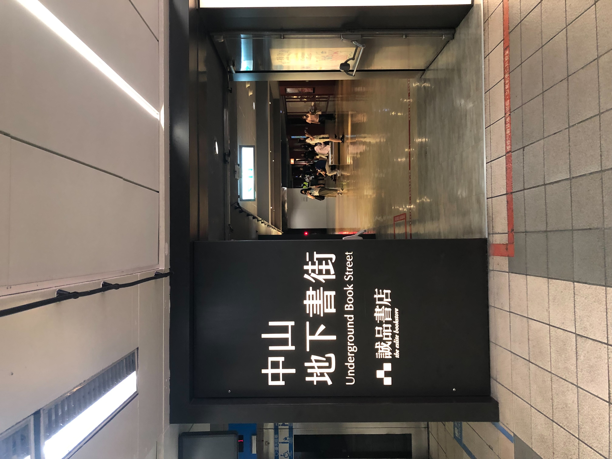

這一天的減敏嘗試，是請弟弟陪我到中山地下街，捷運總共要搭五站。

剛開始在等車與前面兩三站時，身體不算太舒服，那種過去的神經迴路衝了好幾次上來，具體來說會很想逃離現場，不過我覺得那種不舒服感，有比上週嘗試健身房還好一些。

後來到了中山地下街，在誠品書街待了一陣，以及去提拉米蘇買母親節蛋糕，雖然精神不太能集中，不過狀態還算 OK。（今天的挑戰滿越級打怪的，還好後來狀態 OK）

在誠品書街時，看到弟弟在翻<[恐慌來襲怎麼辦?](https://www.books.com.tw/products/0011018960?sloc=main)>這本書，內心是滿感動的。

近期的積極減敏，以及這幾年以來，他是家人之中最能保持「中性」在看待我的外出障礙，真的滿感謝他的！

